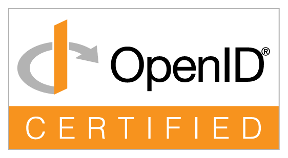

<div align="center">


# POLARIS

**A working reference implementation of an issuer-unlinkable, duress-aware<br>identity-token system, signed with ML-DSA-65 under an audited algorithm-migration path.**

A reference implementation on notional data, not a deployment. CI boots the production-profile stack, the post-quantum TLS handshake, the backup round trip and the disaster-recovery drill on every push.

[](https://github.com/EgorKhaklin/polaris-id/actions/workflows/ci.yml)
[](https://github.com/EgorKhaklin/polaris-id/releases/latest)
[](LICENSE)
[](docs/PRODUCTION-READINESS.md)

[**Project site**](https://egorkhaklin.github.io/polaris-id/) · [What it is](#what-it-is) · [Status](#status) · [Try it](#try-it) · [The ten guarantees](#the-ten-guarantees) · [Architecture](#architecture) · [Verified](#verified-not-asserted) · [Run it](#run-it) · [Documentation](#documentation)

</div>

---

## What it is

Polaris issues, holds, presents and verifies one credential per person, and answers a relying party's two questions separately:

- **Authenticity, offline.** Is the ML-DSA-65 signature genuine? A standalone verifier answers against published keys, with no database and no network.
- **Authorization, fresh.** Is the credential authoritative right now? A relying-party API answers online, or a short-lived signed status assertion answers offline.

Around the credential:

- **The schema is the security boundary.** A 45-table PostgreSQL schema whose triggers, CHECK constraints and unique indexes bind every client: **the guarantees live in the database, not in application code.**
- **Verifiers anyone can hold to a contract.** Python and TypeScript SDKs and a conformance suite of 118 published cases; version 1 of the signed-statement protocol is frozen and re-verified on every push.
- **Explicit federation.** Trust between agencies is explicit and non-transitive.
- **Zero-knowledge by default.** A zero-knowledge verification stores no token identifier; a Plonky2 SNARK, re-checked by an independent second witness, proves ledger membership and nothing else.
- **Gated by invariants.** 334 machine-checked invariants (v1.0.0-rc.62) gate every change in CI.

**The problem it models.** Americans carry six to eight credentials (driver's license, passport, Social Security card and more) with no shared revocation path or audit trail. Polaris models one active credential record per person, verified through context-scoped events (banking, voting, healthcare) at three disclosure levels.

**Three limits.**

- *Zero knowledge means two specific things:* no token identifier stored, and a membership proof. Polaris is **not** a general selective-disclosure or anonymous-credential system.
- *Relying-party correlation is bounded, not eliminated.* What a verifier is **shown** differs from what it has to **store**: a full presentation still shows a stable `token_value`, so two relying parties keeping raw material can correlate. Per-relying-party identifiers mean the value a verifier writes down is unrecognisable at the next one. Findings: [lab/linkability](lab/linkability/README.md).
- *Offline authorization trades revocation latency for issuer non-observation.* A revoked credential's last ACTIVE assertion stays valid until it expires (one hour by default); a high-risk verifier demands online status.

---

## Status

<a href="https://openid.net/certification/certified-oid4vp-haip-final/"></a>

**`polaris-oid4vp 1.0.0rc7` is OpenID Certified™ by Egor Khaklin to the OpenID4VP 1.0 + HAIP 1.0 Verifier profile** (`sd_jwt_vc`, `direct_post.jwt`; [listing](https://openid.net/certification/certified-oid4vp-haip-final/), 24 September 2026). A self-certification the Foundation reviewed and published, for that package version in that role: not an endorsement, not an audit, and not a certification of the rest of Polaris.

| | version | where |
|---|---|---|
| this tree | 1.0.0-rc.62 | the source you are reading |
| `polaris-oid4vp` | 1.0.0rc7 | PyPI; the certified version |
| `polaris-verify`, `polaris-sdk-python` | 1.0.0rc3 | PyPI |
| `polaris-sdk-ts` | 1.0.0-rc.3 | npm, under `next` (`latest` stays 0.1.0) |

- **A release candidate.** A new candidate is cut as a release that collects the defects fixed since the last: see [releases](https://github.com/EgorKhaklin/polaris-id/releases) and the [CHANGELOG](CHANGELOG.md). What separates it from 1.0.0 is an operator who is not the author.
- **Installing:** `pip install --pre` (pip skips candidates otherwise); npm `polaris-sdk-ts@next`. PyPI packages use trusted publishing over OIDC. Every publish is recorded in [RELEASING.md](docs/RELEASING.md).

**Checked by someone other than the author:**

- **An unmodified wallet.** A stock [walt.id](https://walt.id) Wallet API v2 presented an SD-JWT VC over OpenID4VP 1.0 and was accepted (15 September 2026), after first catching a certificate defect nothing internal had. Repeat it in ten minutes: [STRANGER-PATH.md](docs/STRANGER-PATH.md).
- **The OpenID Foundation's hosted suite**, which certified the verifier as above.

Everything else here is the project checking itself: one author's reference implementation on notional data. It has never held real identity data, and there has been no independent security review, no other operator and no pilot. The ledger of outside results is [the scoreboard](lab/EXTERNAL-NOUNS.md).

---

## Try it

The verifier installs from PyPI and needs nothing else from this repository:

```bash
pip install --pre "polaris-verify[cryptography]"
# signature only; issuer trust NOT evaluated
polaris-verify --pqc-provider auto --signature-only --pack your-credential.json
# signature AND a key that belongs to an issuer you trust
polaris-verify --pqc-provider auto --issuer-anchor trusted-keys.json --pack your-credential.json
```

- It refuses to start until you name the cryptography it uses; there is no default.
- **A genuine signature is not a trusted issuer:** without `--issuer-anchor` it abstains (exit 2) rather than report success.

Authenticity is permanent; authorization can change. The same credential after revocation:

```jsonc
POST /api/v1/verify  ->  {
  "authentic": true,                 // the ML-DSA-65 signature is genuine
  "currently_authoritative": false,  // but this token has been revoked
  "status": "REVOKED",
  "usable": false,
  "decision": "reject"
}
```

From a clone (`pip install liboqs-python cryptography`):

```bash
python3 scripts/polaris-verify.py --pqc-provider oqs --selftest        # live ML-DSA-65 round trip
python3 scripts/polaris-verify.py --pqc-provider oqs --verify-dir vectors   # published packs
python3 conformance/run_conformance.py --self                          # 118 published cases
python3 scripts/polaris-compat-suite.py                                # frozen v1 protocol
```

---

## The ten guarantees

The vocation above them: **no person can be compelled to renounce, transfer, or surrender their identity against their will.** Constitutional guarantees (C1, C2, C3, C6, C10) change only by amendment; engineering invariants (C4, C5, C7, C8, C9) keep them honest.

| # | Guarantee | Tier | Enforced by |
|---|---|---|---|
| **C1** | The audit trail is append-only. | Constitutional | Triggers reject `UPDATE`/`DELETE` on audit tables |
| **C2** | A zero-knowledge verification stores no token identifier. | Constitutional | Bidirectional `CHECK` constraint |
| **C3** | One person holds at most one ACTIVE token. | Constitutional | Partial unique index |
| **C4** | Failed-login counting is atomic. | Engineering | Single-statement `UPDATE ... RETURNING` |
| **C5** | No inline scripts (`script-src 'self'`). | Engineering | HTTP response header, verified per route |
| **C6** | Disclosure level is enforced server-side. | Constitutional | Server code paired with redaction tests |
| **C7** | No hardcoded cryptography. | Engineering | Foreign key to `CryptographicAlgorithm` |
| **C8** | Every map/API aggregate is bounded. | Engineering | Hard caps in the SQL functions |
| **C9** | Concurrency is tested with real threads. | Engineering | Threaded suites against a live database |
| **C10** | Identity is not money. | Constitutional | Structural absence, pinned by a check |

Each is machine-checked by [`polaris_checks`](polaris_checks/): 334 plain `check_*` functions (v1.0.0-rc.62), each with a detection test proving it fails on a broken fixture. Why these ten: [MISSION.md](MISSION.md).

---

## Threats answered by construction

| Threat | The answer | Detail |
|---|---|---|
| **Cryptographic compulsion** | A second secret yields a normal-looking verification and records a `DuressEvent`. **Bounded:** resists a coercer who does not know the mechanism exists; not one watching the holder, and net-negative against lawful access (the record is append-only). | [design](docs/design/duress-codes.md) · [assessment](lab/duress/README.md) |
| **Catastrophic loss** | Two-phase recovery with independent out-of-band channels, a cooldown and admin-gated completion. | [recovery-ceremony](docs/design/recovery-ceremony.md) |
| **Algorithm agility** | The algorithm is a row, not a constant (C7); migration through `uc6_migrate` runs in CI, with exactly one active signature per token. | [multi-sig-migration](docs/design/multi-sig-migration.md) |
| **Issuer concentration** | Explicit-only, non-transitive federation gated on an active trust attestation. | [federation](docs/design/federation.md) |
| **Auditability vs. privacy** | A Plonky2 SNARK proves ledger membership and nothing else. | [zk-snark](docs/design/zk-snark.md) |
| **Issuer overreach** | A per-agency revocation-rate ceiling enforced by trigger. | [issuer-discretion](docs/design/issuer-discretion.md) |

---

## Architecture

The schema is the core; everything else is a client of it.

```
      ┌───────────────────────────────────────────────────────────┐
      │  CHECK LAYER          polaris_checks: flat invariant      │
      │                       checks; gates CI; reads everything, │
      │                       writes nothing                      │
      └────────────────────────────┬──────────────────────────────┘
                                   │
      ┌────────────────────────────▼──────────────────────────────┐
      │  APPLICATION          Flask routes: every use case,       │
      │                       the Atlas, WebAuthn MFA, /metrics   │
      │                       polaris_cli: the same over a shell  │
      └──────────┬──────────────────────────────┬─────────────────┘
                 │                              │ subprocess
      ┌──────────▼─────────────┐   ┌────────────▼─────────────────┐
      │  SCHEMA  PostgreSQL 16 │   │  ZK PROVER  Rust + Plonky2   │
      │  tables, procedures,   │   │  Merkle-inclusion SNARK,     │
      │  triggers, append-only │   │  re-verified bit-for-bit by  │
      │  audit (the security   │   │  an independent Python       │
      │  boundary)             │   │  second witness              │
      │                        │   └──────────────────────────────┘
      └──────────┬─────────────┘
                 │ signs under
      ┌──────────▼────────────────────────────────────────────────┐
      │  SIGNATURES           ML-DSA-65 default (FIPS 204),       │
      │                       ML-DSA-87 accepted beside it;       │
      │                       SLH-DSA registered (FIPS 205),      │
      │                       not yet a signer; algorithm         │
      │                       registry: rotation is a row, not a  │
      │                       redeploy                            │
      └───────────────────────────────────────────────────────────┘
```

| Component | What it is |
|---|---|
| [`polaris_sql/`](polaris_sql/) | Schema, use-case procedures, append-only triggers, migrations. |
| [`polaris_web/`](polaris_web/) | Flask application: use-case flows, the Atlas, WebAuthn operator MFA, health and metrics. |
| [`polaris_zk/`](polaris_zk/) | Plonky2 prover (Rust) and [`witness2/`](polaris_zk/witness2/), an independent Python reimplementation. |
| [`polaris_cli/`](polaris_cli/) | Operator CLI for issuance, revocation, recovery and audit. |
| [`polaris_checks/`](polaris_checks/) | The invariant layer: 334 checks (v1.0.0-rc.62). |
| [`packages/`](packages/), [`sdk/`](sdk/), [`conformance/`](conformance/) | The detached verifier, the OpenID4VP verifier, the verify SDKs and the conformance suite. |
| [`scripts/`](scripts/), [`deploy/`](deploy/) | Wallet and relying-party tools, operator tooling, observability config. |

Production topology: a Caddy TLS edge, gunicorn, PgBouncer, PostgreSQL with pgBackRest, and Redis; all non-root with capabilities dropped.

---

## Cryptography

The claim is **algorithm agility under an audited migration path**, not settled security against a quantum adversary: whether Module-LWE holds is mathematics, not a property of this repository.

| Algorithm | Family | PQ | Standard | Security (bits) | Public key | Signature | Role |
|---|---|:---:|---|:---:|---:|---:|---|
| ML-DSA-65 | ML-DSA | ✓ | FIPS 204 | 192 | 1,952 B | 3,309 B | default |
| ML-DSA-87 | ML-DSA | ✓ | FIPS 204 | 256 | 2,592 B | 4,627 B | accepted; migration is a key event |
| SLH-DSA-128s | SLH-DSA | ✓ | FIPS 205 | 128 | 32 B | 7,856 B | registered, no signer |
| SLH-DSA-256s | SLH-DSA | ✓ | FIPS 205 | 256 | 64 B | 29,792 B | registered, no signer |
| ECDSA-P256 | ECDSA | | FIPS 186-4 | 128 | 64 B | 72 B | legacy, sunset 2027 |

- **Two ML-DSA implementations at issuance** (liboqs and OpenSSL) must agree, or issuance fails closed.
- **The TLS edge negotiates X25519MLKEM768** hybrid key exchange, proven in CI; what stays classical is in [PQC-POSTURE.md](docs/reference/PQC-POSTURE.md).
- **The ZK proof needs no trusted setup** (Plonky2, FRI-based).
- **Limits:** without real PQC enabled, development signing writes a named placeholder that verifies against no key; and the classical half of a credential in migration is protected by nothing here. See [PRODUCTION-READINESS.md](docs/PRODUCTION-READINESS.md).

---

## Verified, not asserted

Counts of checks, tables, routes and CI jobs are re-measured by `polaris_checks` on every run; test counts are measured per release.

| Layer | Scale | What it proves |
|---|---|---|
| Product tests (live database) | 1245 | Constraints, use cases, routes, redaction, real-thread concurrency, the secret store |
| Crypto witnesses | 126 passing of 131 collected | ML-DSA across both witnesses and a software PKCS#11 module; Rust and Python epoch roots agree |
| Invariant checks | 334 | C1-C10 plus production posture, each with a detection test |
| CI jobs | 20 | Below |

Test counts: reference machine, v1.0.0-rc.62 (`pytest -q` per suite, 2026-09-26). The five skipped crypto tests need a PKCS#11 module or a real KMS key.

On every push, CI also:

- boots the five-service production-profile stack and checks health through the TLS edge;
- round-trips encrypted backup and restore, and restores a killed primary from the WAL archive;
- rolls a deploy under traffic and fails the HA profile's leader and lease store under writes;
- installs the Linux server profile on Debian and Rocky and the Kubernetes profile on kind;
- proves the post-quantum TLS handshake and real ML-DSA-65 signing in the production image;
- runs the federation, trust-list recovery and version-1 compatibility drills;
- mutation-tests constraints, triggers, procedures and row-level security;
- gates on CVE scans of the Python dependencies and all five images.

```bash
python3 -m polaris_checks.run        # the invariant layer, no database needed
python3 scripts/polaris-ship.py run  # the full local gate, matching CI
```

---

## Run it

**Local (macOS),** with [Docker Desktop](https://www.docker.com/products/docker-desktop):

```bash
git clone https://github.com/EgorKhaklin/polaris-id.git polaris
cd polaris
./Polaris.command
```

Opens `http://localhost:2222` with three seeded roles (notional data, development credentials only):

```
admin     Admin@123!      full access, SQL console
operator  Operator@123!   issue, activate, bind tokens
auditor   Auditor@123!    read-only, warrant audits, duress dashboard
```

**Single host:**

```bash
./scripts/polaris-generate-secrets.sh
export POLARIS_DOMAIN=polaris.example.com
./scripts/polaris-deploy.sh prod
curl -fsS https://$POLARIS_DOMAIN/api/health
```

- **Linux server:** `sudo POLARIS_DOMAIN=polaris.example.com deploy/linux/install.sh` ([docs/operator/LINUX-SERVER.md](docs/operator/LINUX-SERVER.md), [HARDENING](docs/operator/HARDENING.md)).
- **Kubernetes:** the Helm reference profile ([docs/operator/KUBERNETES.md](docs/operator/KUBERNETES.md)).
- **Runbooks:** [INSTALL](docs/operator/INSTALL.md) · [OPERATIONS](docs/operator/OPERATIONS.md) · [SECRETS](docs/operator/SECRETS.md) · [DR](docs/operator/DR.md) · [FAILOVER](docs/operator/FAILOVER.md).

---

## Where Polaris sits

| System | Deployed to a real population | National-scope issuance | Post-quantum default | Unlinkable verification default | Duress-aware primitive | Append-only audit at schema |
|---|:---:|:---:|:---:|:---:|:---:|:---:|
| Real ID (US) | ✓ | ✓ | ✗ | ✗ | ✗ | ✗ |
| mDL / ISO 18013-5 | ✓ | ✓ | ✗ | partial | ✗ | ✗ |
| Aadhaar (India) | ✓ | ✓ | ✗ | ✗ | ✗ | partial |
| e-Estonia | ✓ | ✓ | ✗ | ✗ | ✗ | partial |
| W3C DIDs / VCs | partial | ✗ | method-dependent | method-dependent | ✗ | n/a |
| **Polaris** | **✗** | **✗** | ✓ | ✓ | ✓ | ✓ |

The first two columns matter most: every other row is deployed at national scale; Polaris is neither. Its other ticks are design properties in the codebase, on notional data. None is novel alone; the point is all five in one codebase, enforced at the schema and machine-checked.

---

## Documentation

| If you are | Start with |
|---|---|
| Proving it works yourself | [STRANGER-PATH.md](docs/STRANGER-PATH.md): clean machine to an accepted external-wallet presentation |
| Deciding if it is worth your time | [MISSION.md](MISSION.md) |
| Reviewing the architecture | [ARCHITECTURE-OVERVIEW](docs/ARCHITECTURE-OVERVIEW.md) · [SYSTEM-MAP](docs/reference/SYSTEM-MAP.md) |
| Reviewing security | [SECURITY.md](SECURITY.md) · [PQC-POSTURE](docs/reference/PQC-POSTURE.md) · [RED-TEAM-SCOPE](docs/RED-TEAM-SCOPE.md) · [threat model](docs/design/threat-model.md) |
| Integrating | [API](docs/reference/API.md) · [DATA-MODEL](docs/reference/DATA-MODEL.md) · [GLOSSARY](docs/reference/GLOSSARY.md) |
| Operating an instance | [docs/operator/](docs/operator/README.md) |
| Asking why a mechanism is built this way | [docs/design/](docs/design/README.md) |
| Reading it as research | [Project report, Version 3](docs/paper/polaris_project_report_v3.pdf) (the system at 1.0.0-rc.7) · [Russian edition](docs/paper/polaris_project_report_v3_ru.pdf) · [CITATION.cff](CITATION.cff) |
| Contributing | [CONTRIBUTING.md](CONTRIBUTING.md) · [CHANGELOG.md](CHANGELOG.md) |

---

## Scope, honestly

- **Educational reference implementation**, built as a portfolio project for Seton Hill University, Spring 2026. Notional data only; the seeded credentials are deliberately public.
- **Not production-ready, and says so.** Remaining gaps are operator decisions (key custody, offsite backup, alerting, legal review, penetration test): [PRODUCTION-READINESS.md](docs/PRODUCTION-READINESS.md).
- **Security disclosures:** [SECURITY.md](SECURITY.md).

---

## License

[Apache License 2.0](LICENSE), for its express patent grant. Copyright 2026 Egor Khaklin. If you build on it, retain [LICENSE](LICENSE) and [NOTICE](NOTICE); NOTICE names every dependency license (all permissive except psycopg2, LGPL 3 with an OpenSSL exception, used unmodified).
