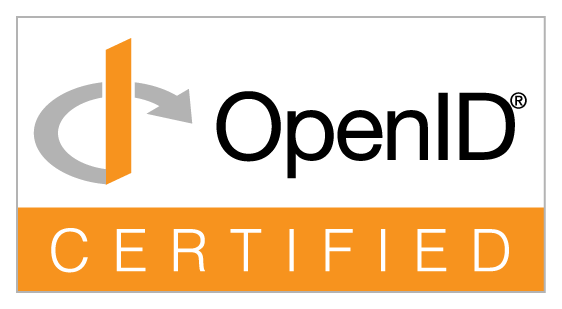

<div align="center">


**Polaris ID is identity infrastructure built to be checked, not trusted.**

[](https://github.com/EgorKhaklin/polaris-id/actions/workflows/ci.yml)
[](https://github.com/EgorKhaklin/polaris-id/releases/latest)
[](#status)
[](docs/reference/SPEC-COMPLIANCE.md#openid-certified)
[](#status)
[](LICENSE)
[](https://www.bestpractices.dev/projects/15004)
[](https://www.bestpractices.dev/projects/15004)
[](https://scorecard.dev/viewer/?uri=github.com/EgorKhaklin/polaris-id)

[](docs/reference/SPEC-COMPLIANCE.md#openid4vp-10)
[](docs/reference/SPEC-COMPLIANCE.md#haip-10)
[](docs/reference/SPEC-COMPLIANCE.md#sd-jwt-vc)
[](docs/reference/SPEC-COMPLIANCE.md#openid4vci-10)
[](docs/reference/SPEC-COMPLIANCE.md#token-status-list)
[](docs/reference/SPEC-COMPLIANCE.md#ml-dsa-65)
[-5b4b8a?labelColor=0a1421&style=flat-square)](docs/reference/SPEC-COMPLIANCE.md#fn-dsa-draft-fips-206)

[](https://pypi.org/project/polaris-verify/)
[](https://www.npmjs.com/package/polaris-sdk-ts)
[](https://discord.gg/ragewuCKj)

<a href="https://polaris-id.e-khaklin.workers.dev/"></a>
<a href="#try-it"></a>
<a href="#status"></a>
<a href="#the-ten-guarantees"></a>
<a href="#documentation"></a>

</div>


## What it is

An authority issues a credential signed with **ML-DSA-65**; the person holds it; anyone checks it two ways.

- **Authenticity, offline.** A standalone verifier checks the signature against published keys, with no database and no network.
- **Authorization, fresh.** A relying-party API, or a short-lived signed status assertion, says whether the credential counts right now.
- **The rules live in the database.** A 60-table PostgreSQL schema whose triggers, CHECK constraints and unique indexes bind every client; 379 machine-checked invariants and 30 CI jobs gate every change.
- **Wallets speak to it.** `polaris-oid4vp` is an OpenID4VP 1.0 + HAIP 1.0 verifier for SD-JWT VC, as a library or a server.

It is **pre-pilot software on notional data**: it has never held real identity data, and nobody but the author has operated it.


## Try it

One minute, from an empty folder. An independent, OpenID Certified wallet ([eudi-dev](https://github.com/dominikschlosser/eudi-dev)) presents a credential to the verifier installed from PyPI, then three tampered presentations must each be refused. Needs `python3` 3.9 or newer. Docker is optional: `run.sh` uses it when it is running, and `EUDI_NATIVE=1 bash run.sh` runs the wallet's own binary instead.

```bash
r=https://raw.githubusercontent.com/EgorKhaklin/polaris-id/main
curl -fsSLO $r/lab/interop/eudi-dev/run.sh
curl -fsSLO $r/lab/interop/waltid/issue_sdjwt_vc.py
curl -fsSLO $r/lab/interop/requirements.txt
bash run.sh
# RESULT: accepted, and all three controls refused
```

Or verify a published credential offline, in Python or TypeScript:

```bash
pip install --pre "polaris-verify[cryptography]"
r=https://raw.githubusercontent.com/EgorKhaklin/polaris-id/main
curl -fsSLO $r/vectors/ml-dsa-65-valid.json
curl -fsSLO $r/vectors/anchors/ml-dsa-65-issuer.json
polaris-verify --pqc-provider auto --issuer-anchor ml-dsa-65-issuer.json --pack ml-dsa-65-valid.json
# signature_valid: True, issuer_trusted: True, exit 0
```

`pip install --pre polaris-oid4vp` · `pip install --pre polaris-sdk-python` · `npm install polaris-sdk-ts@next`. The verifier refuses to start until you name its cryptography, and without a trust anchor it abstains rather than report success. Step by step, with a ten-minute version: [STRANGER-PATH.md](docs/STRANGER-PATH.md).


## Status

<a href="https://openid.net/certification/certified-oid4vp-haip-final/"></a>

**`polaris-oid4vp 1.0.0rc7` is OpenID® Certified™ by Egor Khaklin to the OpenID4VP 1.0 + HAIP 1.0 Verifier profile** (`sd_jwt_vc`, `direct_post.jwt`; [listing](https://openid.net/certification/certified-oid4vp-haip-final/), 24 September 2026). A self-certification the Foundation reviewed and published, for that package version in that role: not an endorsement, not an audit, and not a certification of the rest of Polaris. OpenID® and OpenID® Certified™ are trademarks of the OpenID Foundation, used under its [certification terms](https://openid.net/certification/mark/).

**Tested against software nobody here wrote.** Six wallets ran unmodified: walt.id, Credo, eudi-dev, OID4VCgo, ProtocolSoup and Procivis One Core. Eight more libraries, services and test tools took part: the European Commission's reference OpenID4VP libraries (Kotlin and Swift) and PID issuer, vck, Multipaz and irmago through a wallet built here, and SpruceID's adapter and ERICA through their own wallet harnesses. Every run carries controls that must be refused, and a [weekly canary](.github/workflows/wallet-canary.yml) re-runs them against the newest release. The author drove every walk: this is interoperability, not use. Dated runs: [the scoreboard](lab/EXTERNAL-NOUNS.md#wallets).

**Not yet:** an independent security review, an operator other than the author, a pilot. What separates the release candidates from 1.0.0 is one outside operator reaching a verified result without help. Versions: [RELEASING.md](docs/RELEASING.md).


## The ten guarantees

The vocation above them: **no person can be compelled to renounce, transfer or surrender their identity against their will.** Constitutional guarantees change only by amendment ([MISSION.md](MISSION.md)); each is pinned by a check that fails the build if it stops being true.

| # | Guarantee | Tier | Enforced by |
|---|---|---|---|
| **C1** | The audit trail is append-only. | Constitutional | Triggers reject `UPDATE`/`DELETE` on audit tables |
| **C2** | A zero-knowledge verification stores no token identifier. | Constitutional | Bidirectional `CHECK` constraint |
| **C3** | One person holds at most one ACTIVE token. | Constitutional | Partial unique index |
| **C4** | Failed-login counting is atomic. | Engineering | Single-statement `UPDATE ... RETURNING` |
| **C5** | No inline scripts (`script-src 'self'`). | Engineering | HTTP response header, verified per route |
| **C6** | Disclosure level is enforced server-side. | Constitutional | Server code paired with redaction tests |
| **C7** | No hardcoded cryptography. | Engineering | Foreign key to `CryptographicAlgorithm` |
| **C8** | Every map/API aggregate is bounded. | Engineering | Route-level caps (`_ATLAS_MAX_*`) applied before the SQL sees a caller's count |
| **C9** | Concurrency is tested with real threads. | Engineering | Threaded suites against a live database |
| **C10** | Identity is not money. | Constitutional | Structural absence, pinned by a check |

The hard problems, each bounded: **coercion** (a second code yields a normal-looking verification and records a duress event; it works on a coercer who does not know the mechanism exists, not on one watching the holder, and is net-negative against lawful access: [assessment](lab/duress/README.md)), **total loss** (a witnessed, three-channel [recovery](docs/design/recovery-ceremony.md)), and **algorithm migration** (the algorithm is a row; credentials carry old and new signatures through an audited [migration](docs/design/multi-sig-migration.md)).


## Cryptography

The claim is **algorithm agility under an audited migration path**, not settled security against a quantum adversary: whether Module-LWE holds is mathematics, not a property of this repository, and the classical half of a credential in migration is protected by nothing here ([PQC-POSTURE.md](docs/reference/PQC-POSTURE.md)).

| Algorithm | Family | PQ | Standard | Security (bits) | Public key | Signature | Role |
|---|---|:---:|---|:---:|---:|---:|---|
| ML-DSA-65 | ML-DSA | ✓ | FIPS 204 | 192 | 1,952 B | 3,309 B | default |
| ML-DSA-87 | ML-DSA | ✓ | FIPS 204 | 256 | 2,592 B | 4,627 B | accepted; migration is a key event |
| Falcon-padded-1024 | FN-DSA | ✓ | FIPS 206 (draft) | 256 | 1,793 B | 1,280 B | verified; experimental signer |
| SLH-DSA-128s | SLH-DSA | ✓ | FIPS 205 | 128 | 32 B | 7,856 B | registered, no signer |
| SLH-DSA-256s | SLH-DSA | ✓ | FIPS 205 | 256 | 64 B | 29,792 B | registered, no signer |
| ECDSA-P256 | ECDSA | | FIPS 186-4 | 128 | 64 B | 72 B | legacy, sunset 2027 |

Two ML-DSA implementations must agree at issuance or it fails closed; the TLS edge negotiates X25519MLKEM768. The detached verifier and both SDKs also check the FN-DSA family (draft FIPS 206): signatures 2.6 times smaller than ML-DSA-65's, with two independent implementations (liboqs, @noble/post-quantum) agreeing on its conformance vectors. Polaris signs under it only as an experimental signer, opted into and never in production, two-witnessed like ML-DSA, until its signing time passes Polaris's side-channel test.

The migration path is tested beyond these: in the lab, one population moved through seven signature families (ML-DSA, FN-DSA, SLH-DSA, MAYO, UOV, SNOVA, CROSS) and 136 liboqs signature variants, never left without a valid signature ([CANDIDATES.md](lab/crypto-migration/CANDIDATES.md)). Lab results admit no algorithm to the product.


## Limits, stated plainly

- **Zero knowledge means two specific things:** no token identifier stored, and a membership proof. Polaris is not a general selective-disclosure or anonymous-credential system.
- **Relying-party correlation is bounded, not eliminated.** What a verifier is **shown** differs from what it has to **store**: a full presentation still shows a stable `token_value`, so two relying parties keeping raw material can correlate; per-relying-party identifiers make what a verifier writes down unrecognisable at the next. [lab/linkability](lab/linkability/README.md).
- **Offline status trades revocation latency for issuer non-observation:** a revoked credential's last assertion stays valid until it expires (an hour by default).
- **Not production-ready.** What stands between this repository and real identity data: [PRODUCTION-READINESS.md](docs/PRODUCTION-READINESS.md).


## Where Polaris sits

| System | Deployed to a real population | National-scope issuance | Post-quantum default | Unlinkable verification default | Duress-aware primitive | Append-only audit at schema |
|---|:---:|:---:|:---:|:---:|:---:|:---:|
| Real ID (US) | ✓ | ✓ | ✗ | ✗ | ✗ | ✗ |
| mDL / ISO 18013-5 | ✓ | ✓ | ✗ | partial | ✗ | ✗ |
| Aadhaar (India) | ✓ | ✓ | ✗ | ✗ | ✗ | partial |
| e-Estonia | ✓ | ✓ | ✗ | ✗ | ✗ | partial |
| W3C DIDs / VCs | partial | ✗ | method-dependent | method-dependent | ✗ | n/a |
| **Polaris** | **✗** | **✗** | ✓ | ✓ | ✓ | ✓ |

Every other row is deployed at national scale; Polaris is neither. Its ticks are design properties on notional data.


## Documentation

| If you want to | Start with |
|---|---|
| See it work on your machine | [STRANGER-PATH.md](docs/STRANGER-PATH.md) · run the whole stack: [INSTALL](docs/operator/INSTALL.md) |
| Decide if it is worth your time | [MISSION.md](MISSION.md) · [the scoreboard](lab/EXTERNAL-NOUNS.md) |
| Review the architecture | [ARCHITECTURE-OVERVIEW](docs/ARCHITECTURE-OVERVIEW.md) · [SYSTEM-MAP](docs/reference/SYSTEM-MAP.md) · [DATA-MODEL](docs/reference/DATA-MODEL.md) |
| Review security | [SECURITY.md](SECURITY.md) · [threat model](docs/design/threat-model.md) · [RED-TEAM-SCOPE](docs/RED-TEAM-SCOPE.md) · [REVIEW-PACKET](docs/REVIEW-PACKET.md) |
| Integrate | [API](docs/reference/API.md) · [SPEC-COMPLIANCE](docs/reference/SPEC-COMPLIANCE.md) · [GLOSSARY](docs/reference/GLOSSARY.md) |
| Operate an instance | [docs/operator/](docs/operator/README.md) · [Linux server](docs/operator/LINUX-SERVER.md) · [Kubernetes](docs/operator/KUBERNETES.md) · [evaluate an install](docs/operator/EVALUATE.md) |
| Read it as research | [Project report](docs/paper/polaris_project_report_v3.pdf) · [CITATION.cff](CITATION.cff) |
| Ask or contribute | [Discussions](https://github.com/EgorKhaklin/polaris-id/discussions) · [Discord](https://discord.gg/ragewuCKj) · [CONTRIBUTING.md](CONTRIBUTING.md) · [CHANGELOG.md](CHANGELOG.md) |

## License

[Apache License 2.0](LICENSE), for its express patent grant. Copyright 2026 Egor Khaklin. Retain [LICENSE](LICENSE) and [NOTICE](NOTICE) if you build on it.

<br>

<div align="center">


<br>


<sub><i>Fixus inter mutabilia</i> · fixed amid the mutable</sub>

</div>
